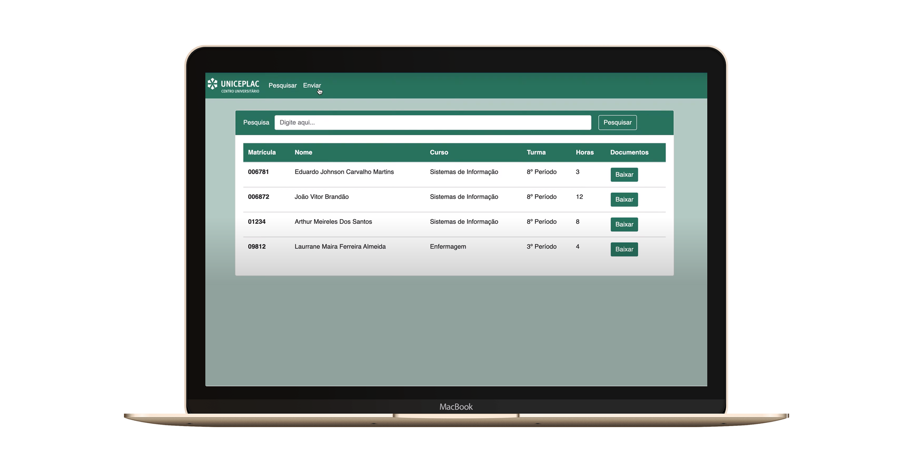

<h1 align="center">
    
</h1>

<h4 align="center">
  🚀 Horas Complementares
</h4>

  

  
  
  

  <a href="#rocket-tecnologias">Tecnologias</a>&nbsp;&nbsp;&nbsp;|&nbsp;&nbsp;&nbsp;
  <a href="#-projeto">Projeto</a>&nbsp;&nbsp;&nbsp;|&nbsp;&nbsp;&nbsp;
  <a href="#-layout">Layout</a>&nbsp;&nbsp;&nbsp;|&nbsp;&nbsp;&nbsp;

 

  

## :rocket: Tecnologias

Esse projeto foi desenvolvido com as seguintes tecnologias:

- [Node.js](https://nodejs.org/pt-br/docs/)
- [Express.js](https://expressjs.com/pt-br/)
- [Mysql](https://dev.mysql.com/doc/)

## 💻 Projeto

O Projeto de Horas complementares foi desenvolvido para gerenciar as atividades complementares da instituição.

## 🔖 Layout

O layout foi desenvolvido em bootstrap.

---

Feito com ♥ by ME :wave:
